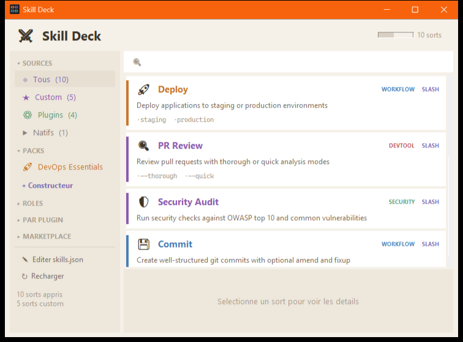
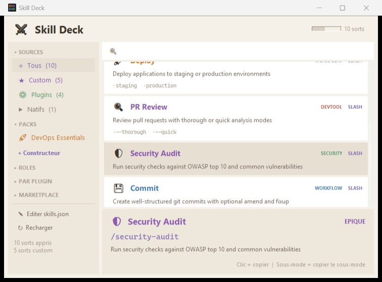

# Skill Deck

**RPG-style inventory for your Claude Code skills.**

Browse your skills like a spellbook — organized by rarity, role, source, and custom packs. Click any skill to copy its command to clipboard. Build custom packs to group your favorite skills together.

<p align="center">
  
</p>

<p align="center">
  
</p>

## Features

- **Rarity tiers** — Legendary, Epic, Rare, Uncommon, Common (color-coded like loot)
- **Role categories** — Agents, Workflows, Dev Tools, Security, Meta, Knowledge
- **Source filters** — Custom skills, Plugins, Native commands
- **Pack Builder** — Create and save custom skill packs
- **Marketplace browser** — Browse installed Claude Code plugins
- **Sub-modes** — Click sub-mode buttons to copy specific variants
- **Clipboard** — Click any skill card to copy its command instantly
- **Always on top** — Stays visible while you work
- **File watcher** — Auto-reloads when `skills.json` changes externally
- **Collapsible sidebar** — Sections remember their collapsed state

## Installation

**Requirements:** Python 3.10+ with tkinter (included in standard Python installs).

1. Clone or download this repository
2. Double-click `launch.bat` (Windows) or run:
   ```bash
   python dashboard.pyw
   ```

## Customization

### Adding skills — `skills.json`

Edit `skills.json` to add your own skills. Each skill has this structure:

```json
{
  "command": "/my-skill",
  "name": "My Skill",
  "icon": "⚡",
  "description": "What this skill does",
  "source": "custom",
  "role": "workflow",
  "rarity": "rare",
  "invocation": "slash",
  "submodes": [
    {"cmd": "/my-skill --fast", "label": "--fast", "desc": "Quick mode"}
  ]
}
```

| Field | Values |
|---|---|
| `source` | `custom`, `plugin`, `native` |
| `role` | `agent`, `workflow`, `devtool`, `security`, `meta`, `knowledge` |
| `rarity` | `legendary`, `epic`, `rare`, `uncommon`, `common` |
| `invocation` | `slash` (manual `/command`) or `auto` (triggered automatically) |
| `plugin_name` | Optional — groups skills under "PAR PLUGIN" in sidebar |

### Custom packs

Packs group skills by their commands. Add them in `skills.json`:

```json
{
  "packs": {
    "My Pack": {
      "icon": "🚀",
      "description": "My favorite tools",
      "commands": ["/commit", "/test", "/deploy"]
    }
  }
}
```

Or use the built-in **Pack Builder** (click "+ Constructeur" in the sidebar).

### Theme override — `config.json`

Create a `config.json` to override theme colors:

```json
{
  "theme": {
    "bg": "#1a1a2e",
    "sidebar": "#16213e",
    "card": "#0f3460",
    "text": "#e0e0e0",
    "accent": "#e94560"
  }
}
```

Available theme keys: `bg`, `sidebar`, `card`, `card_hover`, `card_select`, `border`, `text`, `text2`, `text_dim`, `accent`, `green`, `red`, `detail_bg`.

### Labels

UI labels are defined in the `LABELS` dict at the top of `dashboard.pyw`. Edit them to translate the interface to your language.

## Pack Builder

1. Click **"+ Constructeur"** in the sidebar
2. Type a pack name and pick an icon
3. Click skills in the list to add/remove them
4. Click **"Sauvegarder"** to save the pack
5. Your pack appears in the sidebar under PACKS

You can navigate between filters (sources, roles, plugins) while the builder stays active — useful for finding skills across categories.

## License

MIT
